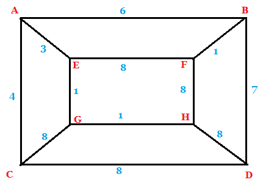
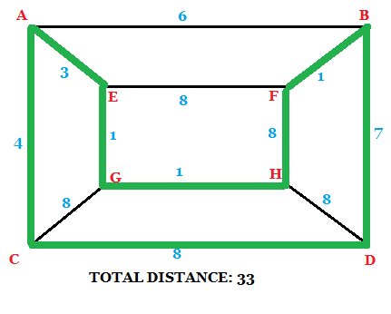

#Traveling Salesman Problem



Every point on this graph represents a city, and the number on the line between two cities is the distance between them.  Your challenge:  Find the path that visits every city once (ending in the same city you started in) with the lowest possible length.

## Adjacency Matrix

That picture above is easy for a human to interpret, but not great for a computer.  Enter the adjacency matrix!  It's a chart that shows the distance from every city to every other city.

| |A|B|C|D|E|F|G|H|
|---|---|---|---|---|---|---|---|---|
|**A**|0|6|4|---|3|---|---|---|
|**B**|6|0|---|7|---|1|---|---|
|**C**|4|---|0|8|---|---|8|---|
|**D**|---|7|8|0|---|---|---|8|
|**E**|3|---|---|---|0|8|1|---|
|**F**|---|1|---|---|8|0|---|8|
|**G**|---|---|8|---|1|---|0|1|
|**H**|---|---|---|8|---|8|1|0|

We can make it even easier for a computer by rendering that chart as  a 2-dimensional array, and replacing the blanks with an arbitrarily large placeholder.

```javascript
distances = [
    [0, 6, 4, 100, 3, 100, 100, 100],
    [6, 0, 100, 7, 100, 1, 100, 100],
    [4, 100, 0, 8, 100, 100, 8, 100],
    [100, 7, 8, 0, 100, 100, 100, 8],
    [3, 100, 100, 100, 0, 8, 1, 100],
    [100, 1, 100, 100, 8, 0, 100, 8],
    [100, 100, 8, 100, 1, 100, 0, 1],
    [100, 100, 100, 8, 100, 8, 1, 0],
    ]
```

Note that we no longer refer to the cities with letters; instead, cities are represented as their index into the array.  To find the distance from G to C, for instance, we would look at `distances[6][2]`.  (The arbitrarily large value could also be `Infinity` in JavaScript or `float("inf")` in Python, two constants defined as being greater than any other number in the language.)

## Test Cases

Here are some more (randomly generated) cases to use when testing your code:

```javascript
distances = [
	 [0, 8, 2, 3, 8], 
	 [8, 0, 2, 10, 5], 
	 [2, 2, 0, 7, 6], 
	 [3, 10, 7, 0, 6], 
	 [8, 5, 6, 6, 0], 
	]

distances = [
	 [0, 3, 1, 4, 9], 
	 [3, 0, 10, 6, 5], 
	 [1, 10, 0, 8, 6], 
	 [4, 6, 8, 0, 7], 
	 [9, 5, 6, 7, 0], 
	]

distances = [
	 [0, 5, 9, 8, 10, 9, 2, 9, 9, 2], 
	 [5, 0, 7, 9, 3, 7, 7, 5, 2, 2], 
	 [9, 7, 0, 4, 9, 7, 6, 8, 8, 10], 
	 [8, 9, 4, 0, 10, 2, 3, 2, 9, 3], 
	 [10, 3, 9, 10, 0, 5, 5, 6, 6, 1], 
	 [9, 7, 7, 2, 5, 0, 10, 9, 4, 1], 
	 [2, 7, 6, 3, 5, 10, 0, 5, 3, 8], 
	 [9, 5, 8, 2, 6, 9, 5, 0, 8, 7], 
	 [9, 2, 8, 9, 6, 4, 3, 8, 0, 4], 
	 [2, 2, 10, 3, 1, 1, 8, 7, 4, 0], 
	]

distances = [
	 [0, 9, 10, 7, 3, 7, 2, 1, 10, 2], 
	 [9, 0, 10, 1, 9, 2, 3, 7, 7, 3], 
	 [10, 10, 0, 8, 6, 4, 10, 4, 6, 6], 
	 [7, 1, 8, 0, 4, 8, 5, 9, 5, 5], 
	 [3, 9, 6, 4, 0, 6, 3, 5, 3, 1], 
	 [7, 2, 4, 8, 6, 0, 5, 1, 9, 3], 
	 [2, 3, 10, 5, 3, 5, 0, 9, 1, 6], 
	 [1, 7, 4, 9, 5, 1, 9, 0, 2, 7], 
	 [10, 7, 6, 5, 3, 9, 1, 2, 0, 7], 
	 [2, 3, 6, 5, 1, 3, 6, 7, 7, 0], 
	]

distances = [
	[0, 26, 29, 11, 8, 25, 49, 4, 33, 42, 50, 27, 11, 33, 5, 4, 8, 21, 30, 49],
	[26, 0, 24, 19, 21, 3, 25, 12, 36, 7, 46, 8, 18, 9, 42, 50, 12, 16, 38, 39],
	[29, 24, 0, 17, 43, 25, 42, 46, 31, 49, 9, 9, 13, 30, 33, 28, 9, 5, 21, 42],
	[11, 19, 17, 0, 49, 7, 21, 49, 17, 18, 29, 10, 41, 12, 4, 35, 49, 7, 44, 38],
	[8, 21, 43, 49, 0, 12, 30, 29, 35, 50, 37, 45, 3, 40, 47, 32, 9, 34, 22, 42],
	[25, 3, 25, 7, 12, 0, 36, 12, 6, 36, 14, 2, 42, 18, 39, 19, 15, 37, 28, 5],
	[49, 25, 42, 21, 30, 36, 0, 12, 17, 24, 22, 20, 16, 29, 46, 30, 34, 5, 38, 9],
	[4, 12, 46, 49, 29, 12, 12, 0, 26, 19, 41, 28, 40, 36, 30, 12, 4, 38, 46, 27],
	[33, 36, 31, 17, 35, 6, 17, 26, 0, 27, 24, 44, 33, 46, 23, 22, 30, 35, 36, 19],
	[42, 7, 49, 18, 50, 36, 24, 19, 27, 0, 3, 6, 32, 27, 18, 43, 33, 45, 26, 31],
	[50, 46, 9, 29, 37, 14, 22, 41, 24, 3, 0, 44, 43, 47, 26, 28, 20, 12, 6, 24],
	[27, 8, 9, 10, 45, 2, 20, 28, 44, 6, 44, 0, 6, 3, 33, 25, 9, 12, 5, 46],
	[11, 18, 13, 41, 3, 42, 16, 40, 33, 32, 43, 6, 0, 36, 47, 17, 31, 21, 3, 38],
	[33, 9, 30, 12, 40, 18, 29, 36, 46, 27, 47, 3, 36, 0, 1, 5, 23, 32, 49, 20],
	[5, 42, 33, 4, 47, 39, 46, 30, 23, 18, 26, 33, 47, 1, 0, 2, 7, 48, 5, 43],
	[4, 50, 28, 35, 32, 19, 30, 12, 22, 43, 28, 25, 17, 5, 2, 0, 18, 28, 35, 50],
	[8, 12, 9, 49, 9, 15, 34, 4, 30, 33, 20, 9, 31, 23, 7, 18, 0, 27, 44, 23],
	[21, 16, 5, 7, 34, 37, 5, 38, 35, 45, 12, 12, 21, 32, 48, 28, 27, 0, 5, 30],
	[30, 38, 21, 44, 22, 28, 38, 46, 36, 26, 6, 5, 3, 49, 5, 35, 44, 5, 0, 49],
	[49, 39, 42, 38, 42, 5, 9, 27, 19, 31, 24, 46, 38, 20, 43, 50, 23, 30, 49, 0],
	]
```

## This is hard!

You're right, it is!  In fact it's *NP-hard*.  That term has a technical definition (you can read about it on [Wikipedia](https://en.wikipedia.org/wiki/P_versus_NP_problem), for instance), but for our purposes, it means that:

1. There's no known polynomial time algorithm, and many theoreticians believe there never will be (though this is still a very open question)
2. It can be transformed into any other NP-hard problem in polynomial time

The first statement gets at the difficulty: There don't need to be that many cities for finding the absolute best solution to become infeasible.  The 20-city test case above is too vast for my computer to solve in a reasonable amount of time.  When you're dealing with an NP-hard problem, the question rapidly goes from *How can I get the best answer?* to *How can I get a good enough answer quickly?*

The second statement shows why these problems are important.  If you can find an algorithm that does solve the travelling salesman problem in polynomial time, you will also have found the best known solution to hundreds of other open problems in many different fields.  

## PS

Here's my answer for the graph from the beginning:

